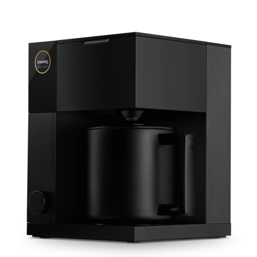

# Fellow Aiden Integration for Home Assistant



> *“A good brew is like a good friend: reliable, comforting, and occasionally in need of a little maintenance.”*  

This is a custom integration that brings your coffee brewer into the Home Assistant universe. Because life’s too short for bad coffee and disconnected devices.

*Special thanks to [Brandon Dixon (9b)](https://github.com/9b) for creating the [fellow-aiden](https://github.com/9b/fellow-aiden) Python library that laid the groundwork for this integration!*

## Table of Contents
- [Features](#features)
- [Installation](#installation)
- [Configuration](#configuration)
- [Services](#services)
- [FAQ & Troubleshooting](#faq--troubleshooting)
- [Contributing](#contributing)
- [License](#license)

---

## Features

- **Real-Time Sensors:**
  - **Sensors** for water usage, number of brews, average water per brew and more—because data is beautiful.
  - **Binary sensors** for brewing, lid status, missing water, baskets inserted, etc.  
- **Device Info:** Displays firmware version, hardware elevation (for you mountaintop dwellers), Wi-Fi and Bluetooth addresses, plus a witty sense of connectedness.
- **Brew Profiles:** Create, list, and delete brew profiles from Home Assistant. No more rummaging for the perfect ratio at dawn.


---

## Installation

Choose one of the following methods to install the **Fellow Aiden** integration:

### 1. Install via HACS

**Prerequisites:**
- **Home Assistant** and **HACS (Home Assistant Community Store)** installed. [HACS Installation Guide](https://hacs.xyz/docs/installation/prerequisites)

**Steps:**

1. **Add the Repository to HACS**
   - Open Home Assistant and go to **Settings > Devices & Services**.
   - Click on **HACS** in the sidebar.
   - Navigate to the **Integrations** tab.
   - Click the **three-dot menu** (⋮) and select **"Add Repository"**.
   - Enter the repository URL:
     ```
     https://github.com/NewsGuyTor/FellowAiden-HomeAssistant/
     ```
   - Choose **"Integration"** as the category and click **"Add"**.

2. **Install the Integration**
   - In HACS, go to the **Integrations** tab.
   - Click the **"+" (Add)** button.
   - Search for **"Fellow Aiden"** and select it.
   - Click **"Install"**.

3. **Configure the Integration**
   - **Restart Home Assistant**.
   - After restarting, navigate to **Settings > Devices & Services**.
   - Click **"Add Integration"**, find **"Fellow Aiden"**, and follow the prompts to log in with your brewer account credentials.

### 2. Manual Installation

**Steps:**

1. **Download or Clone the Repository**
   ```bash
   cd /config/custom_components
   git clone https://github.com/NewsGuyTor/FellowAiden-HomeAssistant.git fellow_aiden
   ```
   - Ensure the folder is named exactly `fellow_aiden`.

2. **Restart Home Assistant**
   - This allows Home Assistant to detect the new integration.

3. **Add the Integration**
   - Go to **Settings > Devices & Services**.
   - Click **"Add Integration"**, search for **"Fellow Aiden"**, and follow the prompts to log in with your brewer account credentials.

---

## Configuration

1. **Credentials**  
   - Enter your email and password for the Fellow Aiden account.  
   - Home Assistant saves these securely in its config entry.

2. **Polling Interval**  
   - The integration polls your device every 1 minute by default.  
   - If your brewer starts complaining about the daily grind, consider adjusting the interval in the options flow (if implemented).

3. **Optional Services**  
   - You’ll see **Create Brew Profile** and **Delete Brew Profile** services that let you manage your brewer from automations or the Developer Tools.

---

## Services
- **`fellow_aiden.create_profile`**: Takes a JSON with brew settings (ratio, bloom, pulses, etc.) and creates a new profile in the brewer.  
- **`fellow_aiden.delete_profile`**: Remove that ill-fated experimental profile from existence.

---

## FAQ & Troubleshooting

1. **It says “Device not found.”**  
   - Make sure you actually have a Fellow Aiden brewer configured with the same account. That helps.  
2. **I see “unknown” for some sensors.**  
   - Possibly the brewer hasn’t updated yet or the sensor values are missing from the device’s API. Wait a minute or two (literally).  
3. **My baskets are showing up as On/Off—why not “Home”/”Away?”**  
   - Because baskets aren’t known for packing suitcases, we changed the device class to `None`. They’re either inserted (On) or not (Off).

---

## Contributing

- **Issues**: Spot a bug, have a feature request, or can’t resist a coffee pun? [Open an issue](https://github.com/NewsGuyTor/FellowAiden-HomeAssistant/issues).  
- **PRs**: Fork, code, and send a pull request. We welcome improvements—just keep code style and good taste in brew puns consistent.  
- **Local Testing**: If you break something, revert changes or blame the brew cycle. Either is acceptable.

---

## License

This project is released under the [GPL-3.0 license](LICENSE). Use it, change it, share it—just don’t blame us if your coffee cravings skyrocket.

---

**Enjoy** your now-connected coffee brewer, and may your mornings be bright, your lid properly closed, and your water tank never empty.
